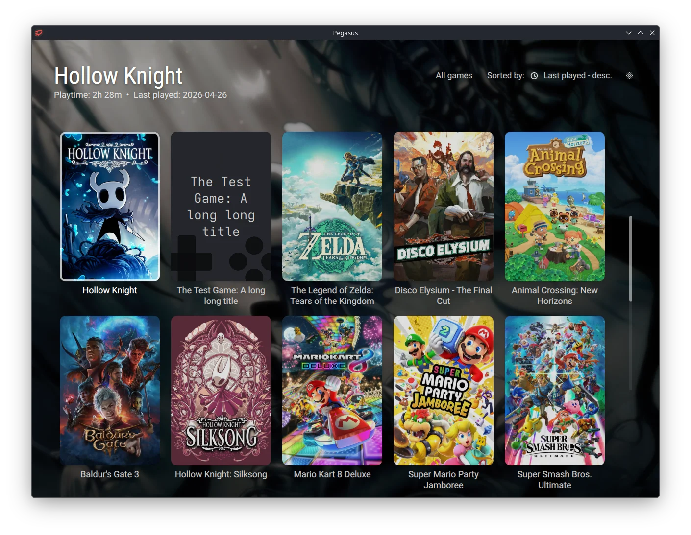
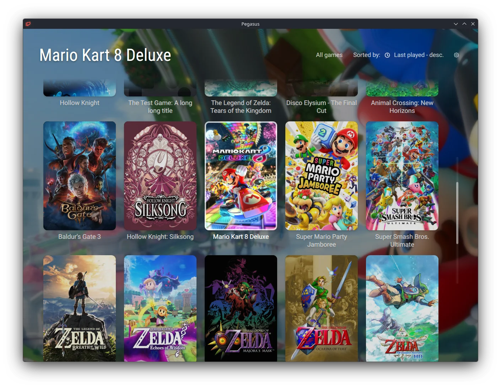
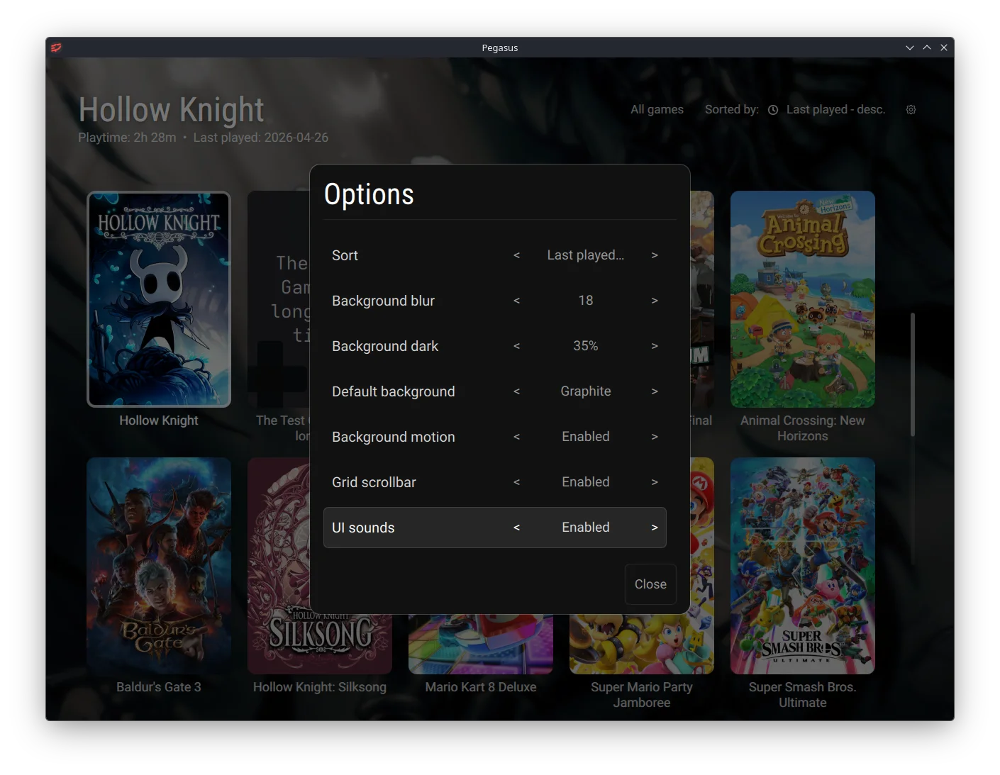

# Clean Covers Desktop

Clean Covers Desktop is a desktop-only [Pegasus Frontend](https://pegasus-frontend.org/) theme built for windowed keyboard and mouse use. It presents the library as a large scrollable grid of cover art, with a compact header for the selected game, collection switching, sorting, and theme options.

This theme intentionally removes controller-first UI patterns. There are no controller hint bars, no row carousel mode, and no gamepad-oriented navigation chrome.

## Screenshots





## Features

- Large scrollable cover grid for desktop windowed use
- Native mouse-wheel grid scrolling
- Hover previews without changing selection
- Click to select, click selected game or double-click any game to launch
- Keyboard shortcuts for navigation, launch, sorting, options, and collection switching
- Sort by last played, title, release year, play count, and play time
- Collection switching
- Persistent theme settings
- Blurred and darkened backdrop with optional motion
- Optional grid scrollbar and UI sounds
- Modal options menu with mouse controls and outside-click close

## Installation

Clone this repository or [download as zip](https://github.com/mlumeau/pegasus-theme-clean-covers-desktop/archive/main.zip) and extract this directory into your Pegasus themes folder:

- Linux: `~/.config/pegasus-frontend/themes/clean-covers-desktop`
- Windows: `%APPDATA%/pegasus-frontend/themes/clean-covers-desktop`
- macOS: `~/Library/Application Support/pegasus-frontend/themes/clean-covers-desktop`

Then select `Clean Covers Desktop` theme in Pegasus Frontend.

## Recommended Pegasus Settings

This theme expects Pegasus to run in desktop windowed mode with mouse support enabled.

In Pegasus:

1. Open the settings menu.
2. Select `Clean Covers Desktop` as the active theme.
3. Enable mouse support.
4. Disable fullscreen mode.

You can also edit Pegasus `settings.txt` directly:

```text
general.theme: themes/clean-covers-desktop/
general.input-mouse-support: true
general.fullscreen: false
```

## Artwork Behavior

The theme prefers these assets when available:

- Covers: `poster`, then `boxFront`, then `tile`
- Backgrounds: `banner`, `steam`, `background`, `screenshot`, then `titlescreen`

When no suitable art is available, the theme falls back to a built-in poster placeholder and a configurable background color.

## Theme Options

The in-theme options menu supports:

- Sort mode
- Background blur strength
- Background darkening
- Fallback background color
- Background motion toggle
- Scrollbar toggle
- UI sounds toggle

## Controls

- Mouse wheel: scroll the grid
- Hover: subtly lift poster and show launch affordance on selected game
- Click: select a game
- Click selected game: launch
- Double-click any game / Enter: launch
- Arrow keys: move selection
- `S`: cycle sort mode
- `O` or `F1`: options
- `Page Up` / `Page Down`: switch collections
- `Esc`: close options

## Notes

This theme is intentionally narrow in scope. It focuses on a clean browsing and launch experience rather than advanced library management features such as search, filters, favorites workflows, or video backgrounds.

## License

This project is licensed under the MIT License. See [LICENSE](LICENSE).
